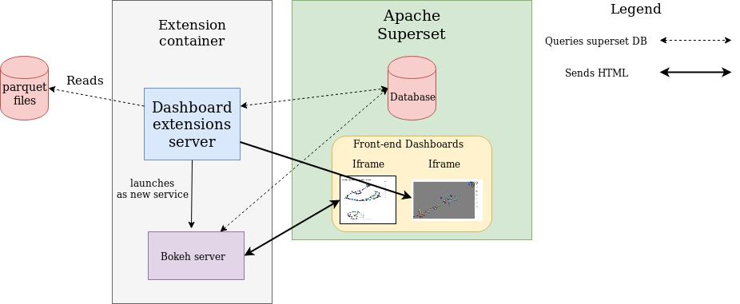
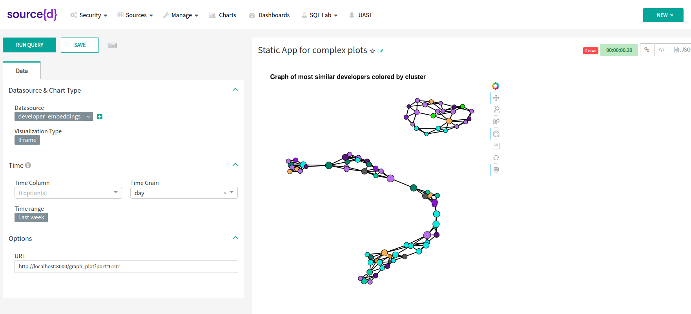
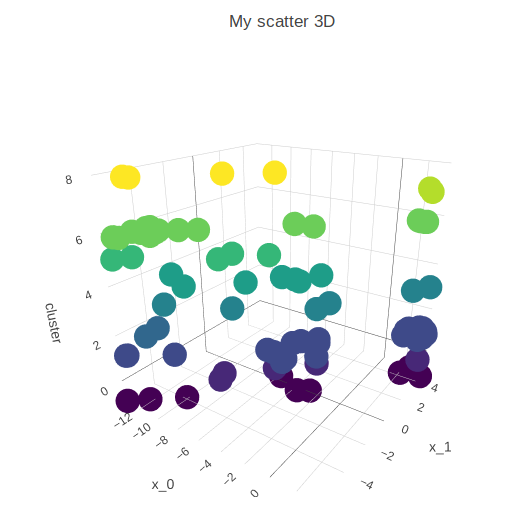
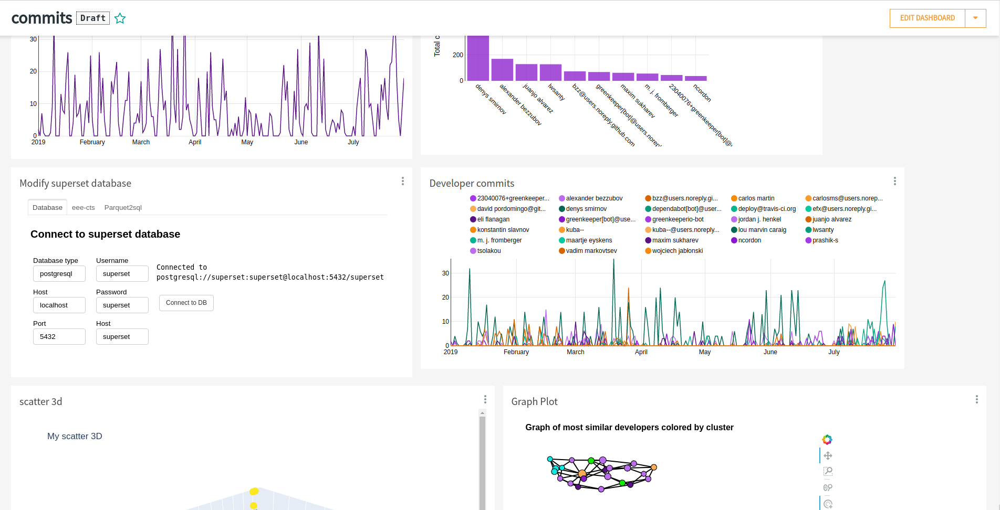
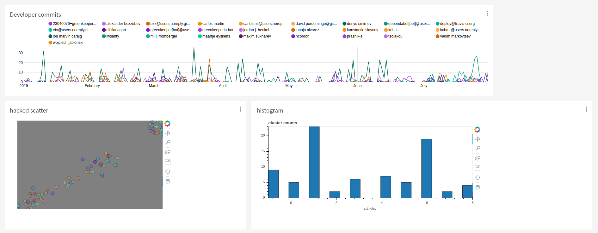
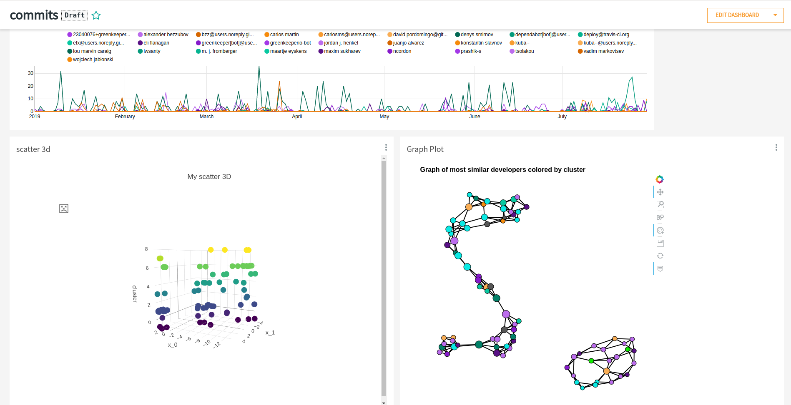
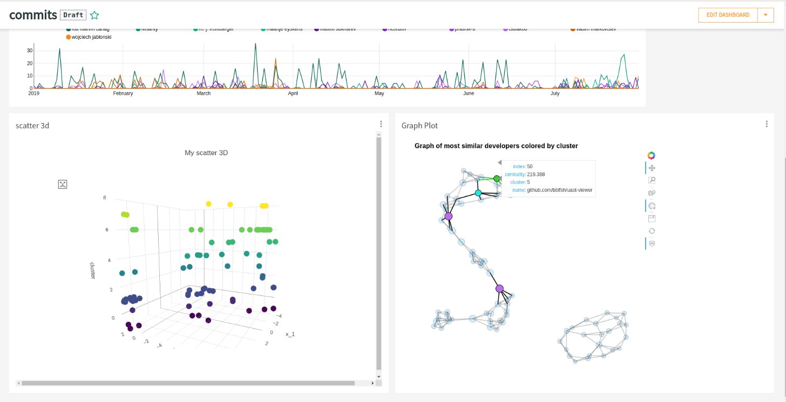
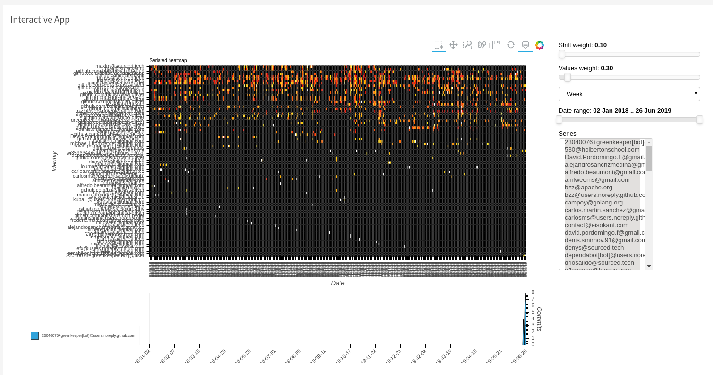

# Dashboard extensions

***This is still work in progress.***

This is a proof of concept for extending the functionality of sourced-ui dashboards as a separate service.

## Get started
You can find a detailed tutorial on how to get started in the [demo](markdown/demo.md) section.

## Why this project

When trying to integrate new `sourced extensions` to `sourced-ui` we often come across the limitations that
superset suffers. Dashboard extensions aims to offer a simple solution to integrate new extensions to `sourced-ui`.

After spending hours working with superset these are a few of the problems that we can encounter:

- Fine tuning the graphic representation of the chart is very difficult: Eliminating the ticks of an axes, or
changing the background color are not easy tasks.

- Creating new kinds of visualizations is not easy: It involves creating the visualization in javascript
 and modifying several files to account for the new plots.
 
- Complex interactivity is very tricky: You can spend a day trying to debug while your filter is failing on some of your plots.

- Superset cannot run custom python code to filter the queried data before plotting it: Running a 
pre-trained model on the queried data and plotting its predictions is not currently possible to do with Superset.

When using `dashboards_extensions`, we will be able to run arbitrary python code on a separate server 
to create any kind of visualization. This visualization will be embedded in a `sourced-ui` dashboard using an **iframe**. 
This way, we can extend superset functionality on demand without modifying the code of `sourced-ui`.

## How it works

It runs a separate service inside a container and it exposes a REST api that returns html code. 
This code is ready to be embedded in an iframe so it can be displayed in a `sourced-ui` dashboard.

### Features

- Runs in a separate docker container that can be added easily to `docker-compose`.
- Very easy to integrate with `sourced-ui` and the current demo environment.
- Provides any custom python functionality that could be needed.
- Allows to expose python visualizations as html files.
- Easy to scale.
- Allows to create interactive plots and control interfaces.

### Loading plots from superset

To load a plot generated using `dashboard_extensions`:

1. Create a visualization of type `iframe`

2. Point the **URL** parameter to the appropiate endpoint.

3. Wait for the visualization to be loaded. If you are running a complex application it can take a few minutes, but if you reload the plot you should get the target plot when it is available.

### Passing parameters to `dashboard_extensions` endpoints

It is possible to add parameters to the `GET` query performed to the server. This allows to modify 
the visual properties of the plot from inside superset.

For example, for customizing an scatter plot 3D, we could use the following url:

> http://localhost:8000/scatter3d?datasource=developer_embeddings&x=x_0&y=x_1&z=cluster&width=900&height=600&color=cluster&title=My%20scatter%203D

Let's break down the url:

- `http://localhost:8000/`: Address where dashboard_extensions is running.
- `scatter3d`: Each endpoint offers different functionality, in this case the server will call the *scatter3d* function.
- `datasource=developer_embeddings`: Corresponds to a table in the superset database that will be loaded as a pandas data frame.
- `x=x_0&y=x_1&z=cluster` Mappings of database columns to plot visual properties:
    * column `x_0` -> **x** coordinates
    * column `x_1` -> **y** coordinates
    * column `cluster` -> **z** coordinates
- `width=900&height=600&color=cluster&title=My%20scatter%203D`: It is also possible to specify visual properties for the plot.

# Running the proof of concept

Building the container:
`docker build -t dashboard_server .`
Running only one app as a simple bokeh server:
`docker run --rm --network="host" -p 5006:5006 -it dashboard_server:latest panel serve dashboard_server/apps/load_data/connect_to_db.py`
Running Dashboard server:
`docker run --rm --network="host" -p 8000:8000  -p 8001:8001 -p 8002:8002 -p 8003:8003 -it dashboard_server:latest python3  dashboard_server/dashboard_server/server.py`

### Gallery

